# ***Puppy Linux Telepítési Útmutató*** #

Készítette: Wild Péter

## *A Puppy Linuxról röviden* ##

A Puppy Linux, az egy **könnyű** otthoni felhasználásra készített Linux disztribúció, amit Barry Kauler készített 2003-ban. A jelenlegi fejlesztők pedig nem más mint Mick Armadio, Larry Short és a Puppy közösség.

Mit értek a könnyű alatt?

* Kis tárhelyet foglal kb 750MB-ot
* Nem igényel sok memóriát, 2GB-on is elfut
* Felhasználóbarát kezelőfelület, sok súgó és segítség áll rendelkezésre
* Régi és új gépeket is támogatja

## A telepítés menete, VirutalBox-ban ##

1. ### A képfájl letöltése ###

    A képfájlt, azt a Puppy Linux főoldaláról tudjuk leszedni, az alábbi linken keresztül:  
[BookwormPup64 képfájl](https://distro.ibiblio.org/puppylinux/puppy-bookwormpup/BookwormPup64/10.0.8/BookwormPup64_10.0.8.iso)

    Ha netán a böngésző megkérdezné, hogy hova mentsük, akkor egy olyan helyre mentsük a képfájlt, ahol könnyen megtaláljuk.  
    Ha nem kérdezi meg a böngésző, hogy hova mentsük, akkor a "Letöltések" között megtaláljuk.

2. ### Virtuális gép létrehozása, a VirtualBox-ban ###

    1. VirtualBox-on kattintsunk az **"Új"**-ra
    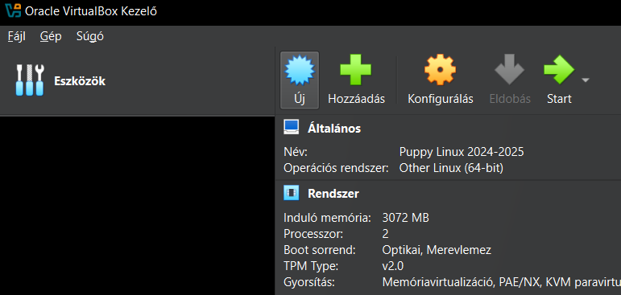
    2. Name and Operating System fülön:
        * "Név"-nél: Nevezzük el a gépünk nevét pl.: **"Puppy Linux"**
        * "Folder"-nél: Adjuk meg, hogy hova mentsük a virtuális gépet, itt nyugodtan maradthat  alapértelmezetten
        * "ISO image"-nél: Válasszuk ki a képfájlt, amit letöltöttünk
        * "Típus"-nál: válasszuk ki a **"Linux"**-ot, ha automatán nem tette volna meg
        * "Subtype:"-nál: válasszuk ki, hogy **"Other Linux"**
        * "Verzió"-nál: szintén hasonlóan válasszuk ki, hogy **"Other Linux (64-bit)"**
        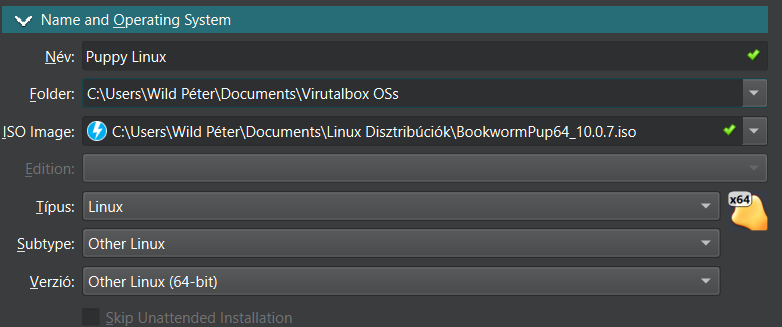
    3. Unattended Install-t kihagyatjuk
    4. Hardware fülön:
        * "Alap memória"-nak: Adjunk meg **2048** vagy **4096** MB-ot, vagy netán saját méret szerint
        * "Processors"-nál: 1 és 4 közötti értéket, processzorunk magjától függően, de **2 magon** is tökéletesen megy
        * "Enable EFI (special OSes only)": Erre nem lesz szükségünk
        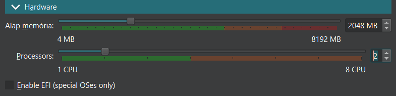
    5. Hard Disk fülön:
        * A "Create a Virtual Hard Disk Now"-nál  
        Csak változtassuk meg a lemeznek a méretét **"8,00 GB"**-ról - **"16,00 GB"**-ra
        * A többi opcióval nincsen dolgunk
        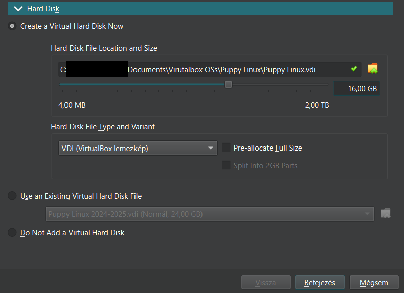
    6. Nyomjuk meg a "Befejezés" gombot

3. ### Virutális gép elindítása és a merevlemez partícionálása ###

    1. Kattintsunk VirtualBox-ban a **"Start"** gombra
    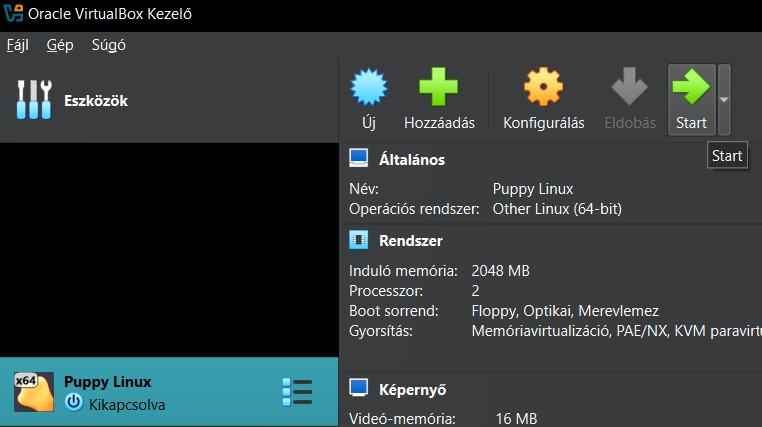
    2. Ha előjött a virtuális gépünk ablaka, akkor válasszuk ki az előjött "Grub" menüből az 1. opciót a BookwormPup64 10.0.0.*-et ami, alapértelmezetten ez van kijelölve, tehát nyomhatunk egy **Enter**-t.  
        * Miután betöltött a Puppy Linux Live OS-e, ami még nem a feltelepített változat, hanem csak egy úgy mondott "telepítő" ezután,
        * A Quick Setupon belül, csak a billentyűzet kiosztást állítsuk magyarra,  
        a "Quick Setup"-nak a jobb alsó sarkában lévő **"Ok"**-ra menyjünk, ha elő jönne, még bármilyen ablak, akkor azokat is **zárjuk be**.
        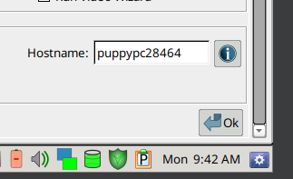
    3. Kattintsunk a bal alsó sarokban látható **"Menu"** gombra és keressük meg a menüben a **"System"** pontot és azon belül a **"GParted"** nevezetű programot nyissuk meg.
    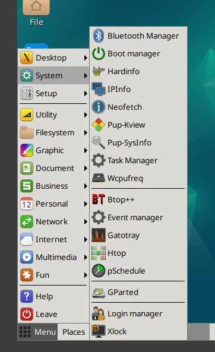
    4. Most, hogy előjött a **"GParted"**, válasszuk ki a lemezünket, ami **"sda internal drive -- ATA VBOX HARDISK(16.0G)"** és nyomjunk rá az **"Ok"**-ra
    5. **"GParted"**-en belül a felső menüben kattintsunk a **"Device"**-ra és azon belül a **"Create Partition Table..."**-re  
    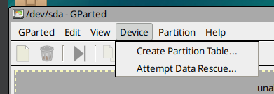
        1. Az előjött ablakon a partíció típus legyen **msdos**, ami alapértelmezetten be van állítva, ezután kattintsunk az **"Apply"**-ra
    6. Jobb egérgombbal kattintsunk rá az **"unallocated"**-re és válasszuk ki a **"New"**-ot  
    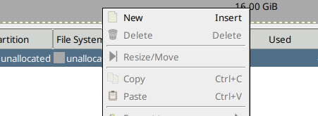
        1. Az előjött ablakon keressük meg a **"New Size"**-t és oda írjuk be, hogy **2048** utána pedig, a **"File system"**-nél válasszuk ki a linux-swap-et és menyjünk rá az **"Add"** gombra
        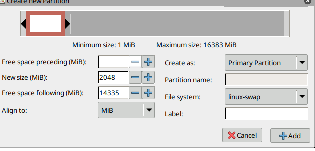
        2. Most mégegyszer menyjünk rá az **"unallocated"**-re és győződjünk meg arról, hogy a **"File system"**-nél **ext4** van kiválasztva, **ha igen** akkor nyomjunk rá az **"Add"**-ra, **ha nem** akkor válasszuk ki a menüből az **ext4**-et és utána nyomhatunk rá az **Add**-ra
        3. Ezután kattintsunk rá a **zöld pipát**-ra és szintén kattintsunk rá az **"Apply"**-ra  
        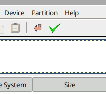  
        Ha elvégezte, a partícionálást, kattintsunk a **"Close"**-ra
    7. Válasszuk ki, az **ext4**-es partíciót és jobb egérgombbal kattintsunk rá és az előjött menüből és válasszuk ki a **"Manage Flags"**-et és keressük meg és jelöljük be az előjött menüben a **"boot"**-ot, ezután a **"GParted"**-et bezárhatjuk.
    
    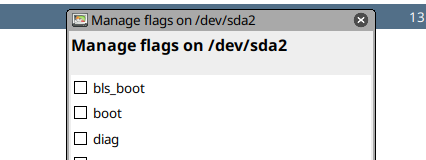

4. ### A Puppy Linux telepítése ###

    1. A bal alsó sarokban található **"Menu"**-re kattintsunk rá és keressük meg a **"Setup"**-ot, majd arra is rá kattintva, keressük meg a **"Puppy installer"**-t és kattintsunk rá.
    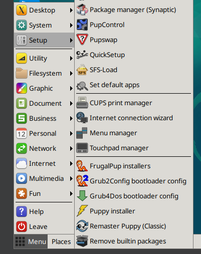
    2. Az előjött ablakon keressük meg és kattintsunk rá az **"Installer"**-re
    3. Az ablak alján található **"Internal hard drive / SSD"**-nek, a jobb oldalán található "merevlemez" ikonra kattintsunk rá.
    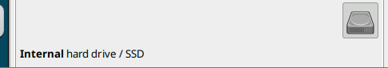
    4. A következő ablaknál szintén a "merevlemez" ikonra kattintsunk.
    5. Mivel a partícionálást elvégeztük, így kattintsunk az ablaknak a jobb oldalán található **"Install Puppy to sda2:"**-re és kattintsunk **"Ok"**-ra az újonnan előjött ablakon.
    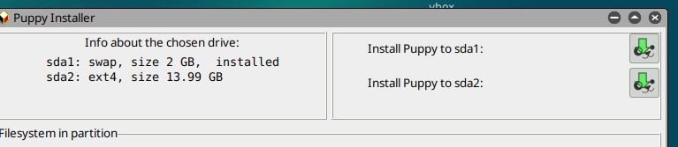
    6. Nevezzük el a mappánknak a nevét amibe a **Puppy Linux** fog települni pl.: **puppyfullinstall** és kattintsunk rá az **"INSTALL"** gombra
    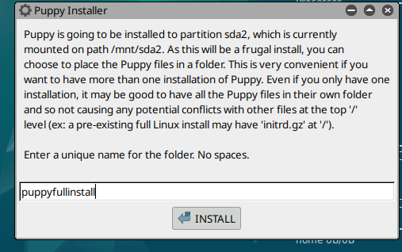
    7. Most, hogy telepítve lett a **Puppy Linux** ezért telepítenünk kell egy **"Grub4dos"** nevezetű bootloader-t (magyarul rendszerbetöltő) [Mi a bootloader?](https://hu.wikipedia.org/wiki/Boot_loader)  
    Ezt a telepítő fel is dobja nekünk, hogy telepítsük, ezért kattintsunk rá a **"Yes"** gombra
    8. Az egymást követő ablakokon csak kattintsunk rá az **"Ok"** gombokra.
    9. A megnyitott text fájlból nem kell semmit sem átmásolnunk, ezért azt is bezárhatjuk és nyomjunk rá megint a következő 2 ablakon az **"Ok"**-ra.
    10. ***Sikeresen telepítettük, a Puppy Linuxot***
    11. Lépjünk ki a virtuális gépből, egyszerűen csak zárjuk be az ablakot az **X** gombbal a jobb felső sarokban és a megjelent ablakban válasszuk ki a **"Kikapcsolni a gépet"** és kattintsunk rá az **"Ok"** gombra.
    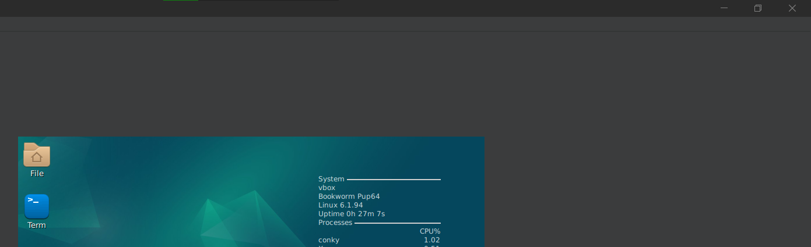
    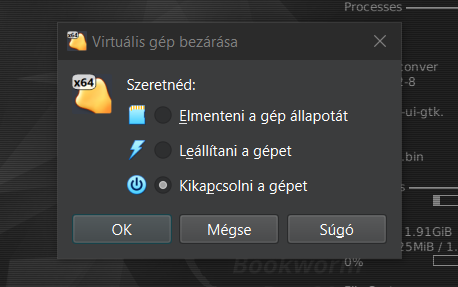

5. ### A feltelepített Puppy Linux indítása ###

    1. Mielött elindítanánk a **Puppy Linux**-ot elötte, néhány fontos lépést kell megtenni
        1. Kattintsunk rá a **"VirtualBox"**-ban a **"Konfigurálás"**-ra és a megjelent ablakon keressük meg és kattintusnk rá, a **"Tároló"**-ra
        2. A **"Tároló"**-nál, kattintsunk rá a **"Paraméterek"**-en belül jobb oldalánál található **kék lemezre** és az előjött menüben kattintsunk rá a **"Remove Disk From Virtual Drive"**-ra és ezután kattintsunk rá az **"Ok"** gombra.
        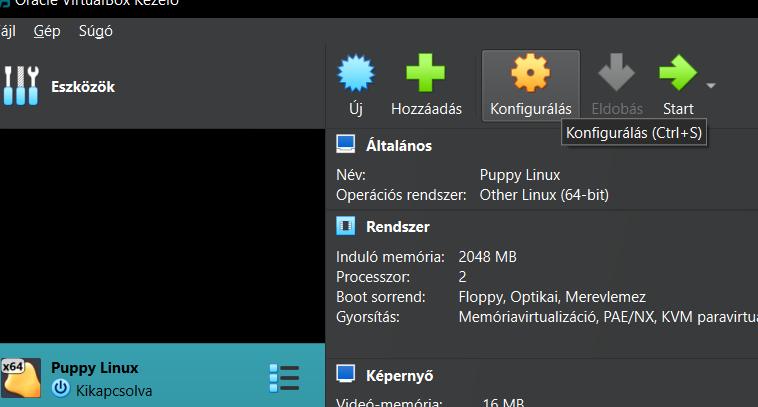
        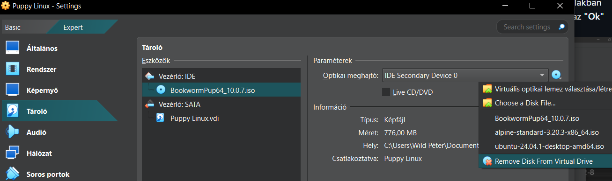
    2. Most már rákattinthatunk a **"Start"** gombra
    3. Az előjött bootloader-ben nyomjunk egy **"Enter"**-t ha a telepített **Puppy Linux** van kijelölve ("puppyfullinstall"-nak szereplenie kell).
    4. Ezután a **Puppy Linux** sikeresen elindult
    5. Az előjött ablakban végezzük el az alábbiakat (**Nem feltétlenül muszáj a lentiek alapján**):
        1. Válasszuk ki az országot: hu_HU Hungarian, Hungary
        2. Válasszuk ki az időzónát: Europe/Budapest
        3. Állítsuk be az órát UTC-re
        4. Válasszuk ki a billentyűzet nyelvét: hu Hungarian
        5. Ha van numpad, akkor nyugottan engedélyezhetjük
        6. Jelöljük be **"Video Wizard"** a kép felbontást beállító programot
        7. A hálózati beállításnál esetleg adjunk meg valami Hostname-t
        8. **"Ok"** gombra rákattintva, végeztünk is
        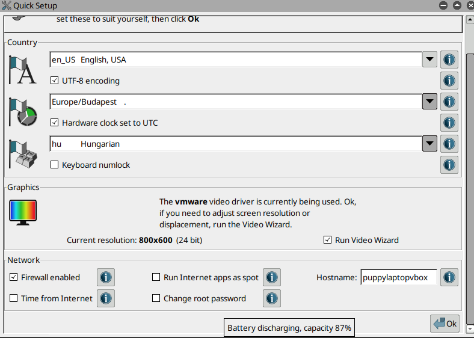
    6. Ha leszeretnénk állítani a gépet, akkor kattintsunk rá a bal alsó sarokban található **"Menu"**-re és utána kattintsunk a **"Leave"** és **"Shutdown"** gombra utána végezzük el az alábbi pontokat amik csak egyszeri alkalommal fognak megjelenni:
        1. Mentsük el a **"Session"**-t, kattintsunk rá a **"SAVE"**-re
        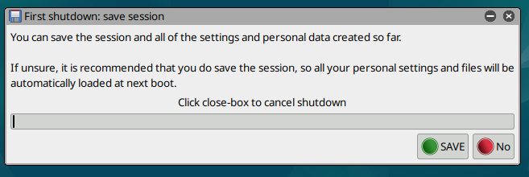
        2. Kattintsunk a **"NORMAL"**-ra
        
        3. A **"folder"**-es opció az maradhat, léphetünk tovább
        4. Adjunk egy nevet a mentésnek pl.: sajátnevünk
        5. Kattintsunk a **"Ok"**-ra
        6. Befejezés képpen kattintsunk a **"YES, SAVE"**-re és készen is vagyunk
        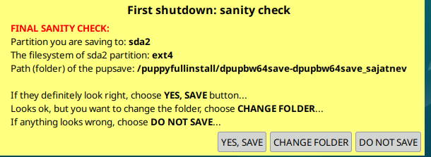

6. ### ***Puppy Linux saját célokra való használása*** 😎👍 ###
