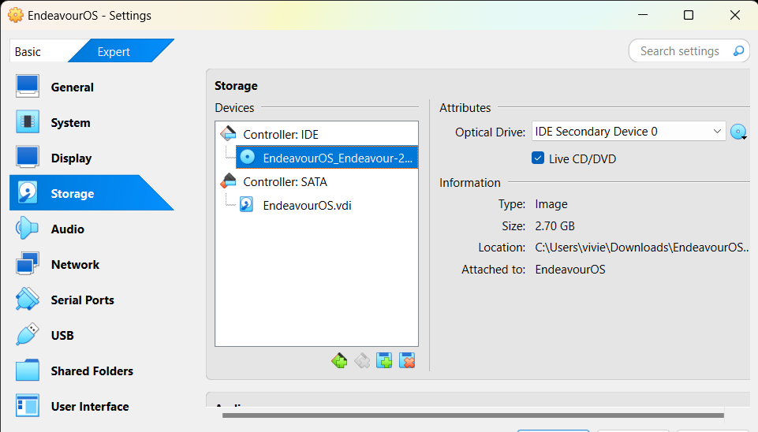

# EndeavourOS telepítési útmutató

## VirtualBox beállítások

A **New** gombra kattintva tudunk egy új virtuális gépet létrehozni!

Először a **Name and Operating System** kategórán belül végezzük el a szükséges beállításokat! A *Name* részben adunk nevet a virtuális gépünknek, ami bármi lehet, nincsenek karakter hossz vagy speciális karakter megkötések! A *Folder* részt hagyhatjuk ahogy van! Az *ISO Image* részben kiválasztjuk az [Endeavour oldaláról](https://endeavouros.com/) letöltött ISO fájlt. A *Type* részben a **Linux** operációs rendszert válasszuk ki, majd a többi kategórát úgy hagyjuk!

A **Base Memory** részben adjuk meg a RAM-ot a virtuális gépünknek, ami a példában 4096 MB vagyis 4GB, ami tökéletesen elég lesz. Alatta a *Processors* részben adjuk meg a CPU magok számát, ami a példán 2 db.

A **Hard Disk** kategórián belül amin változtatunk az a *Create a Virtual Hard Disk Now* részen van, ahol beállíthatjuk a virtuális gép merevlemezének helyét és méretét. Ha ezekkel megvagyunk, akkor kattintsunk lent a **Finish** gombra!

Ezután a **Settings** gombra kattintva további beállításokat fogunk végezni!

A **System** kategóriában először is a kékkel karikázott részt nézzük át, itt ugyanis az OP rendszer boot-olási sorrendje van feltüntetve. A *Floppy* van az első helyen, ami nem lesz jó, mert már ilyet nem használunk, szóval innen nem fog tudni beboot-olni a rendszer, ezért pipáljuk ki, majd húzzuk le a sor legaljára!

Ha átkattintottunk a **Display** kategóriára, akkor a *Video Memory* részen található csúszkát húzzuk fel maximumra és minden mást hagyjunk meg eredeti állapotában!

A **Storage** kategóriában kattintsunk rá az ISO fájlra, majd pedig pipáljuk be a *Live CD/DVD* opciót, amit a kék karika jelez!

Ezek után kattintjunk az **OK** gombra, majd pedig fent középen a **Start** gombra, ls el is indíthatjuk az OP rendszerünket!

A képen látható lehetőség kiválasztása után nyomjon egy *Enter*-t!

Miután elindult az OP rendszer, felugrik a telepítő! Itt válassza ki a *Start the Installer* lehetőséget!

Itt válassza az **Offline** opciót!

Itt válassza ki a nyelvet!

Itt válassza ki a régiót!

Itt válassza ki a billentyűzetet!

Itt válassza ki a **GRUB** lehetőséget!

Itt válassza ki a **Manuális particionálás** lehetőséget!

Itt válassza ki a **Master Boot Record** lehetőséget!

A **Létrehozás** gombra való kattintás után először adja meg a gyökér könyvtár méretét, ami az én esetemben 25 GB! Csatolási pontnak a **/** opciót válassza, majd **Jelölők** részben a *root* opciót válassza!

A **Létrehozás** gombra való kattintás után először adja meg a swap méretét, ami az én esetemben 4 GB! A **Jelölők** részben a *swap* opciót válassza, a **Fájlrendszer** kategóriában pedig a *linuxswap* opciót!

Itt töltse ki a megadott mezőket!

Ezek után kattintson a telepítés gombra, majd pedig várjon, amig elkészül a telepítés. Ezek után indítsa újra a rendszert!

Miután a rendszert bezárta, ismét menjen a **Storage** kategóriába a VirtualBox-on belül, és kattintson jobb egérgombbal az ISO fájlra, ahol megjelenik a *Remove Attachment* gomb. Kattintson rá, és csatolja le az ISO fájlt!

Ezek után bármikor el tudja indítani a virtuális gépet!