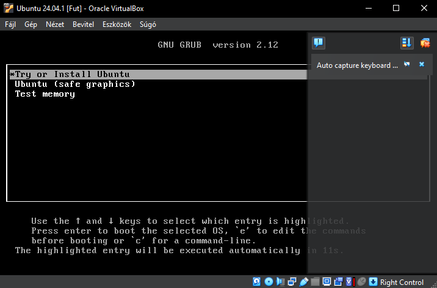
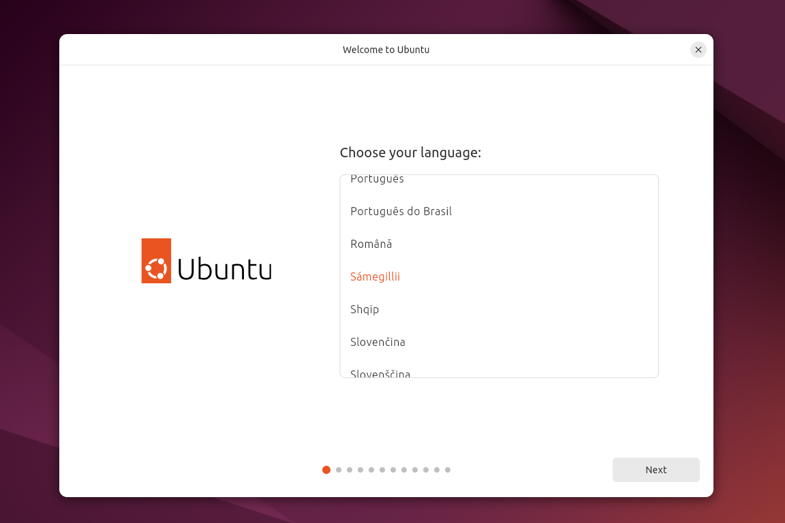
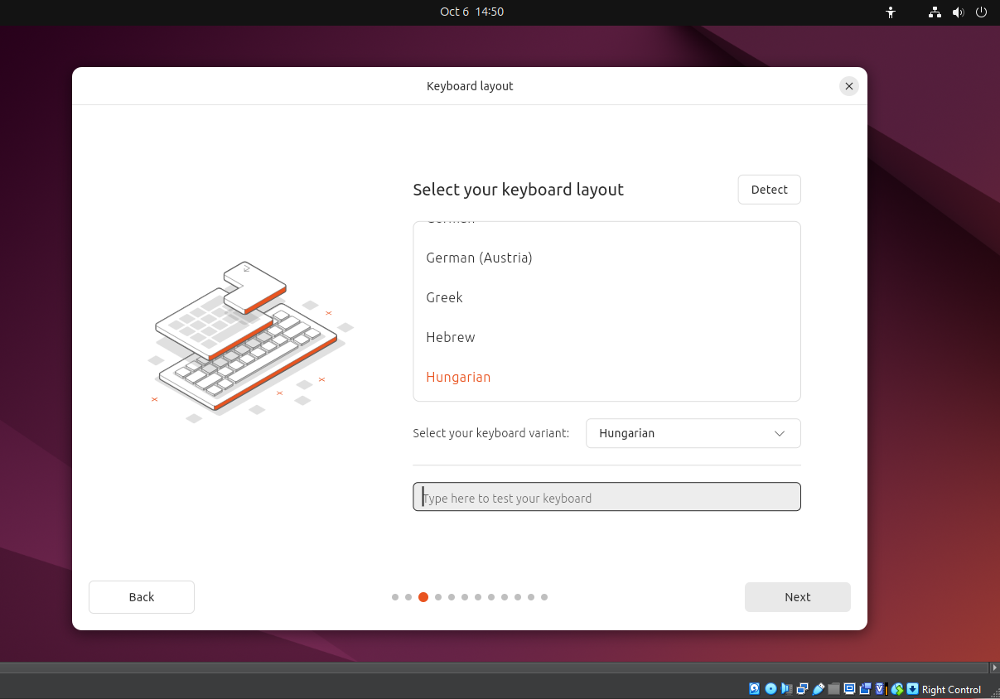
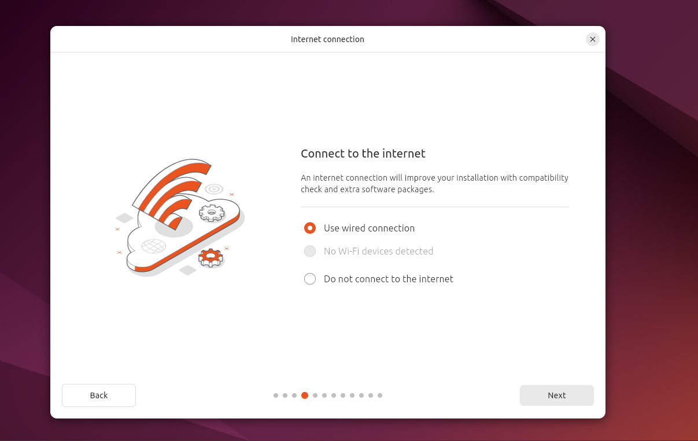
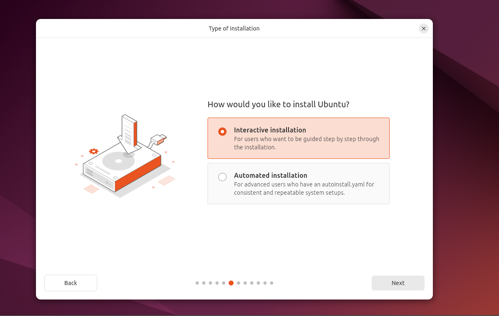
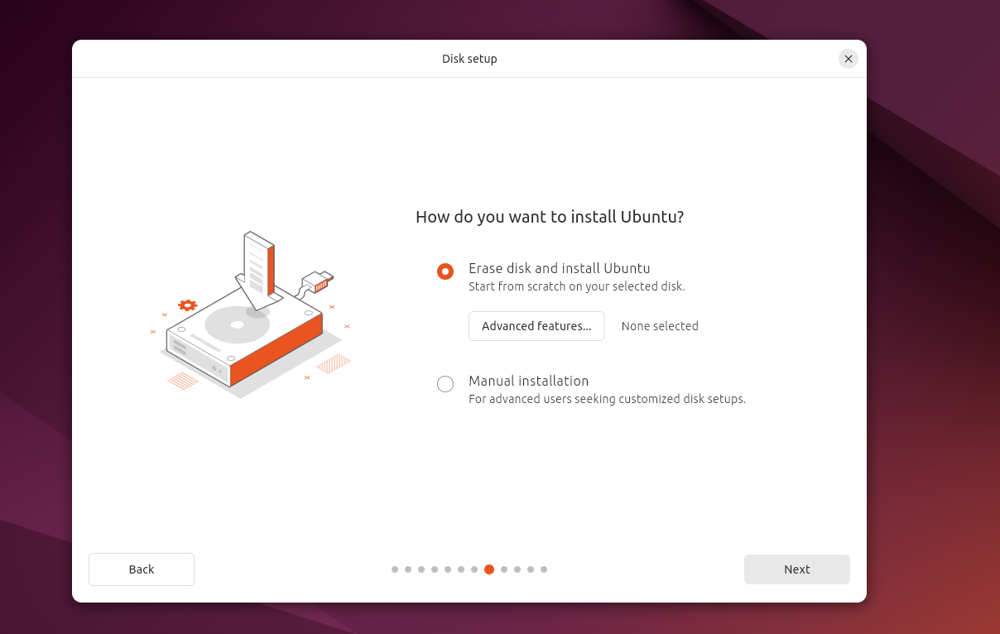
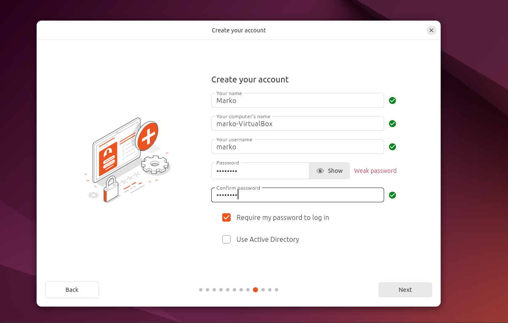
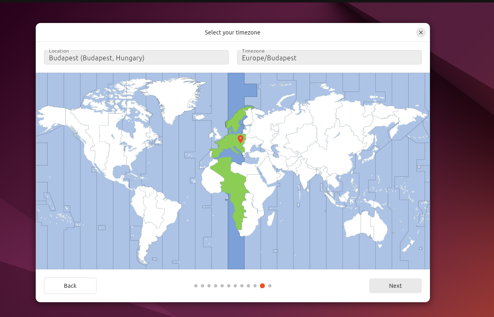
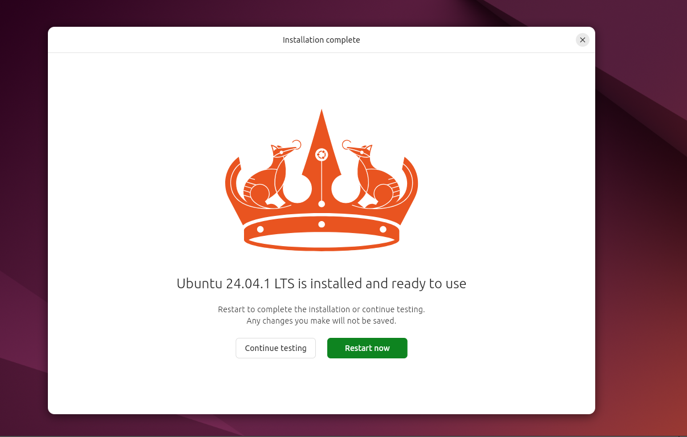
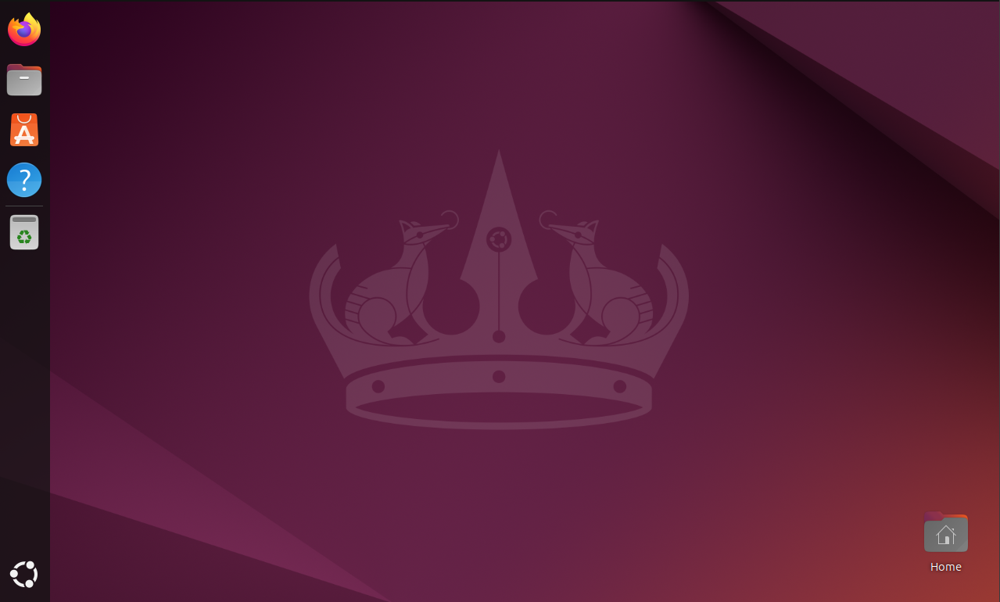

# Ubuntu telepítési dokumentáció

## **1. A telepítés indítása**
Miután elindítottuk a virtualbox-ból az operációs rendszerünket ez a képernyő fogad minket, ahol enter lenyomásával elindítjuk a telepítési folyamatot.

## **2. Nyelv választása**
Ki kell választanunk azt a nyelvet amelyel szeretnénk hogy fusson a rendszer.

## **3. Billentyűzet kiosztás**
Amilyen a billentyűzetünk kiosztása olyan nyelvet kell, hogy válaszunk az én esetemben magyar.

## **4. Internethez való hozzáférés**
Két lehetőség közül válaszhatunk, hogy szeretnénk vagy nem szeretnénk csatlakoztatni a hálózathoz.

## **5. Mihez szeretnénk kezdeni az operációs rendszerrel**
Telepíteni szeretnénk-e vagy csak ki szeretnénk próbálni.

## **6. Milyen alkalmazásokkal alkalmazásokkal szeretnénk kapni az operációs rendszerünket**
Alap vagy bővített csomag közül választhatunk.

## **7. Partícionálás**
Automatikusan vagy manuálisan kívánjuk elvégezni.

## **8. Felhasználó létrehozása**
Létre kell hozznunk egy felhasználót amelyet névvel és egy jelszóval kell ellátnunk.

## **9. Időzona** 
Megfelelő időzóna beállítása.

## **10. Rendszer a felállítása**
Várakoznunk kell amíg a rendszer felállítódik.

## **11. Újraindítás**
Újraindítás után már frissen feltelepített rendszer fog várni minket.

## **12. A szofter használatra kész**
