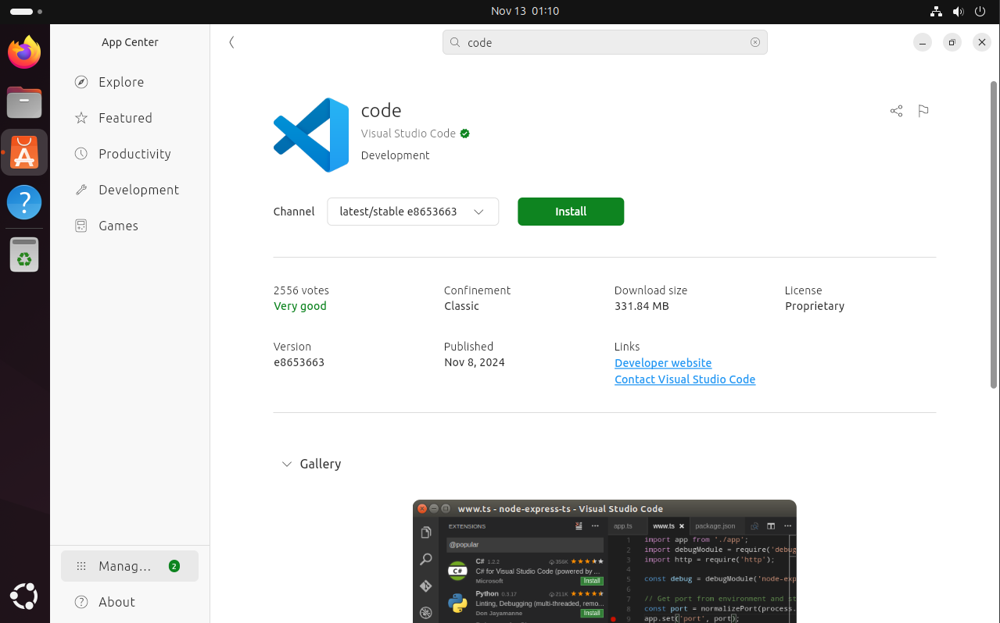
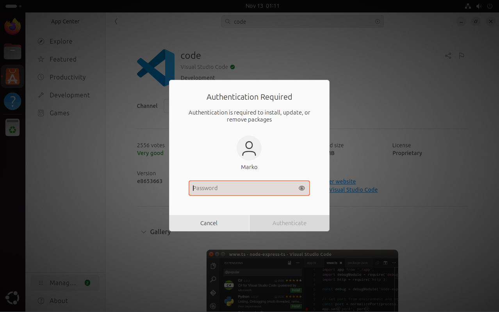
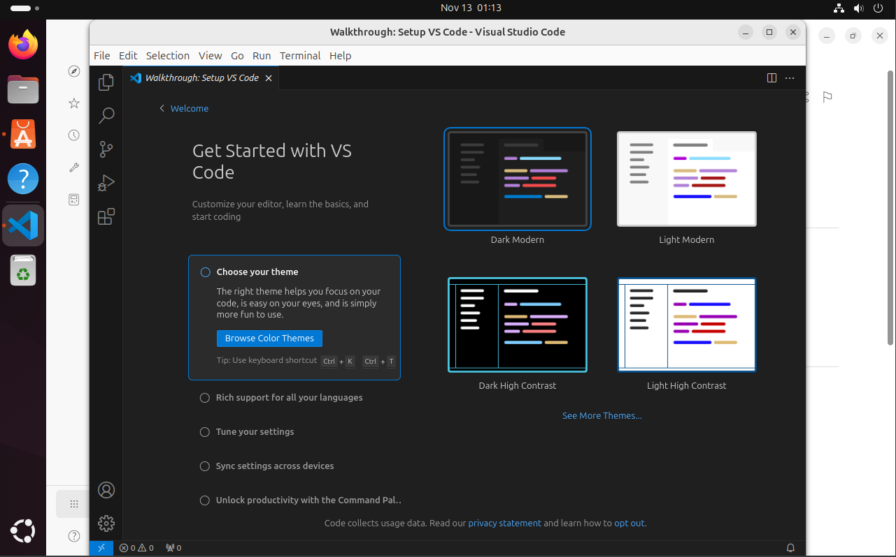

# VScode letöltése

## **1.** 
Megnyitjuk az App center-t majd rákeresünk a Visual Studio Code-ra ha megtaláltuk és rákatintottunk megjelenik az alábbi felület. 

Az Install gombra katintva azt hinnénk letöltés elindult de hitelesítenünk kell a letöltést jelszavunkal is.

## **2.**
Miután letöltött egyetlen dolgunk hogy megnyissuk open gomb segítségével.

## **3.**
Az alkalmazás használatra kész.

