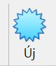
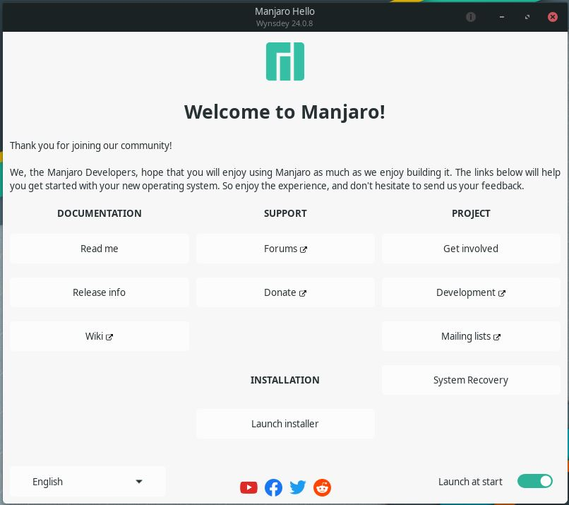
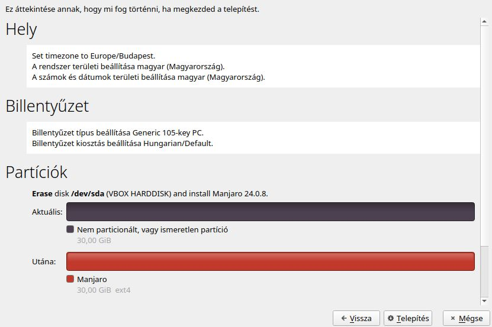
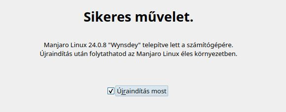

# Manjaro telepítése Virtual Box-ra
## 1. lépés : 
Az első lépés ahoz hogy feltelepítsük a Manjaro-t a Virtual Box-ra az ISO file letöltése lesz, amitt a [Manjaro honlapjáról](https://manjaro.org/products/download/x86) tudunk megtenni, onnan kiválaszthatjuk melyik desktopot szeretnénk. 
## 2. lépés :
Elinditjuk a Virtual Box-ot, rákattintunk az "Új" gombra és elkészitünk egy új virtual machine-t és a [Manjaro wiki oldalán](https://wiki.manjaro.org/index.php/About_Manjaro) részletezett gépigény szerint állitjuk be.  Miután ezzel megvagyunk elinditjuk a virtual machine-t a "Start" gombal.
## 3. lépés :
Miután elindult a virtual machine meg fog nekünk jelenni egy "Manjaro Hello" nevü ablak, hogy elkezdjük a telepítést a "launch installer" gombra kell rányomnunk. 
## 4. lépés :
A "launch install" gomb kattintása után a telepítőn keresztül fogjuk beállitani az [alapértelmezett nyelvet](Images/4.JPG), [időzónát és keltezést](Images/5.JPG), [billentyúzet modelt és nyelvet](Images/6.JPG), a [lemez partíciónálását](Images/7.JPG), a [felhasználó nevét jelszavát és az adminisztrátor jelszót](Images/8.JPG) és végül [libre vagy freeoffice-t](Images/9.JPG) szeretnénk-e feltelepíteni. Ezek beállítása után megkezdödik a Manjaro telepítése. 
## 5. lépés :
A telepítés végeztével a telepítő felajánlja hogy automatikus újraindítja a virtual machine-t de ezt manuálisan is megtehetjük később, újrindítás után használhatjuk is a Manjaroval ellátott virtual machine-t. 
