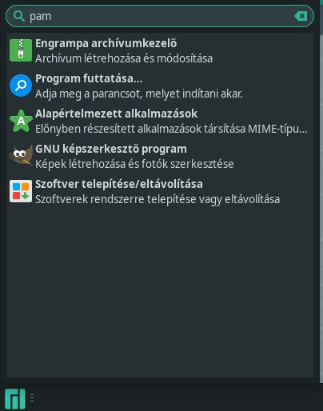
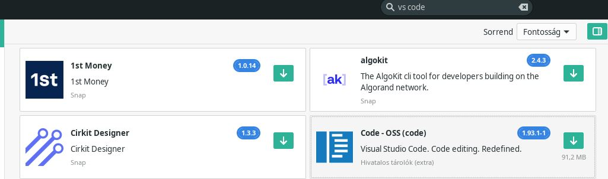
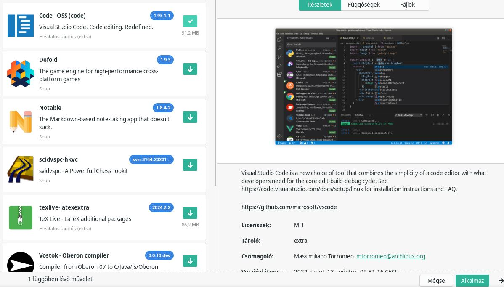
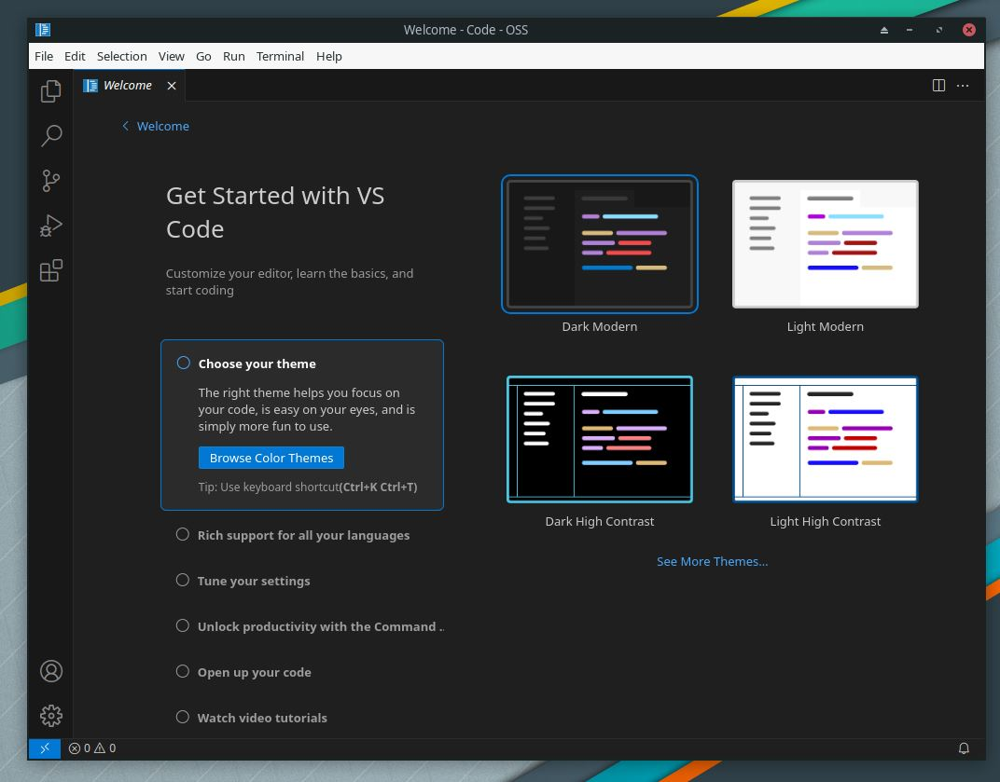

# Visual Studio Code telepítése a Manjaro-ra
## 1. lépés
Kattintsunk bal alul a start menu gombra és a keresőbe írjuk be azt hogy pam.

Miután ezt beírtuk meg kell hogy jellenjen a találatok közt egy olyan nevü program hogy "Szoftver telepítése/eltávolítása", arra kattíntsunk rá.
## 2. lépés
Miután megnyitottuk a programot a bel felül lévő keresőbe beírjuk azt hogy "vs code"  és a találatok közül megjelenő "Code - OSS (code)" jelöljük ki és ezután kattintsunk a jobb alul megjelenő alkalmaz gombra  és ezzel elkezdi a telepítést. A telepítés megkezdése előtt el fogja kérni tölünk a rendszer a jelszót, [jelszó](Images/VSC/4.JPG) a jelszó megadása után összegzi hogy mit fog feltelepíteni a program. [összegzés](Images/VSC/5.JPG) miután ennél az ablaknál rákatintottunk az alkalmaz gombra megkezdödik a telepítés. A telepítés befejtével nincs további tehendönk, szabadon lehet használni a feltelepítet VS code-ot.
