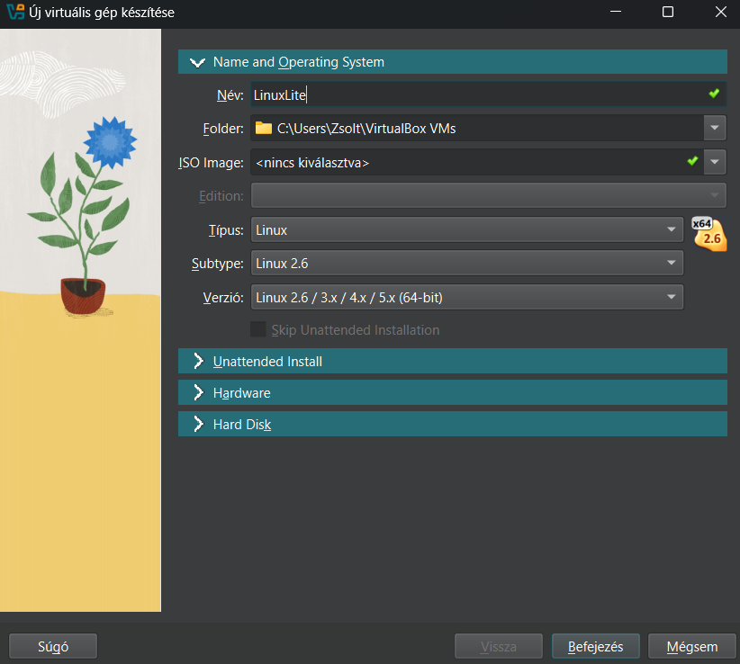
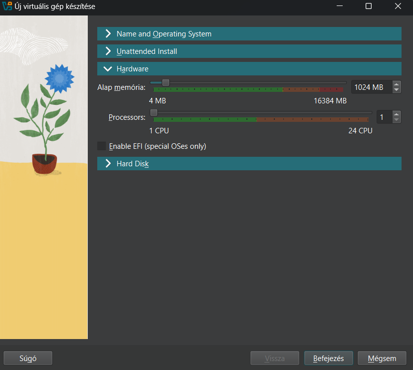
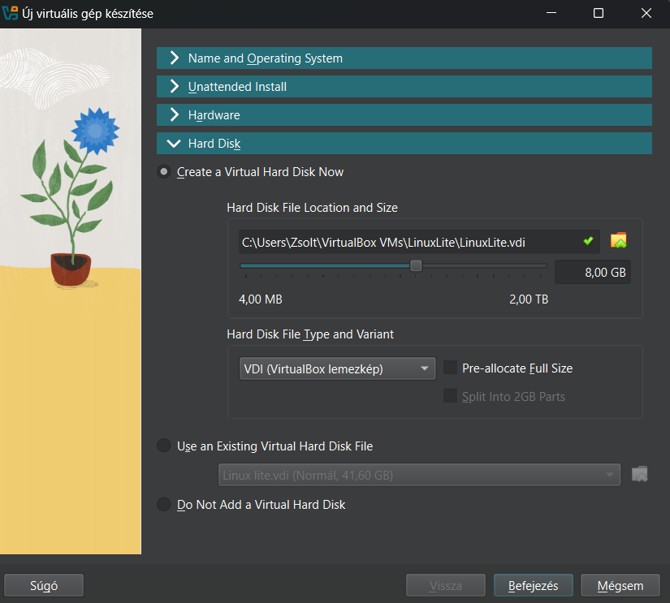
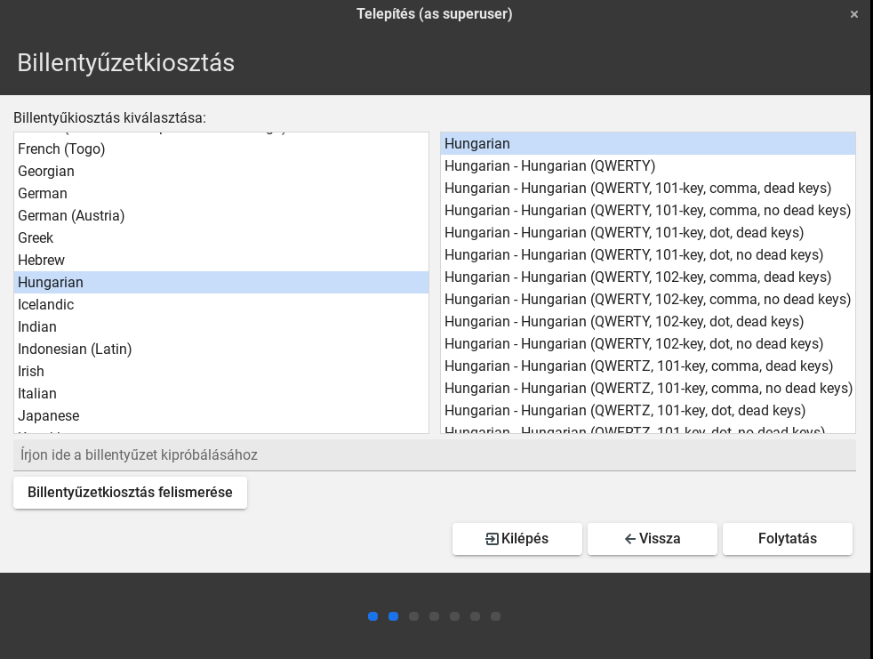
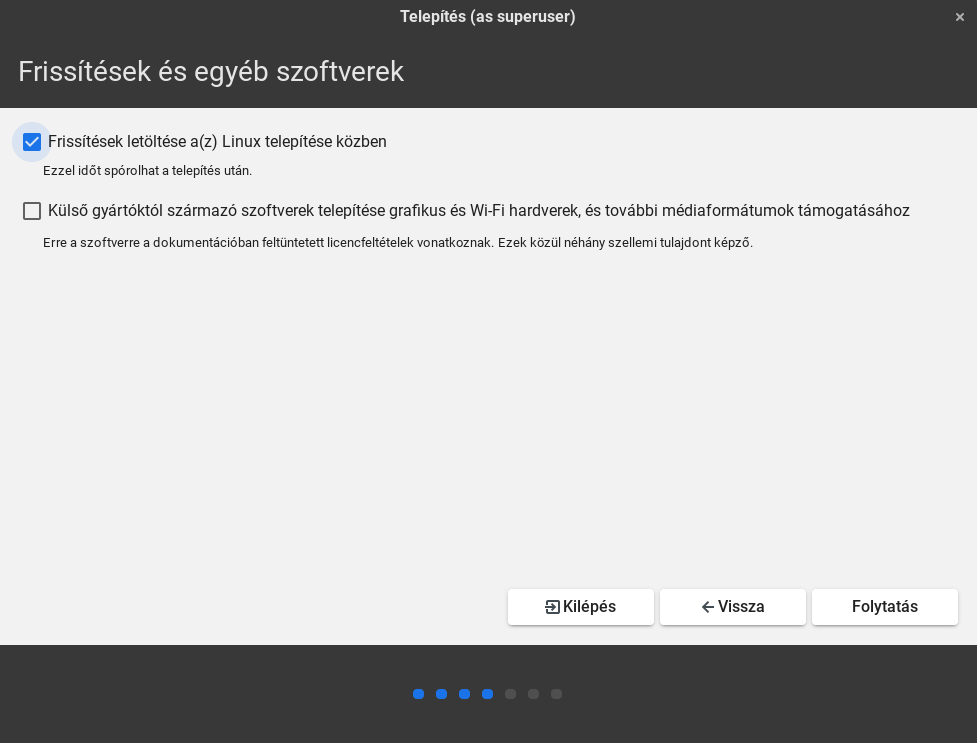
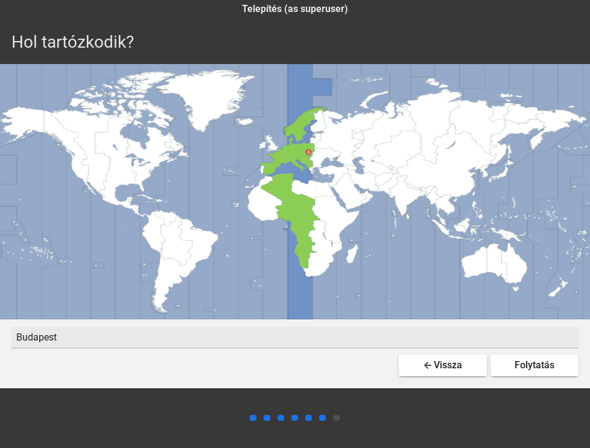
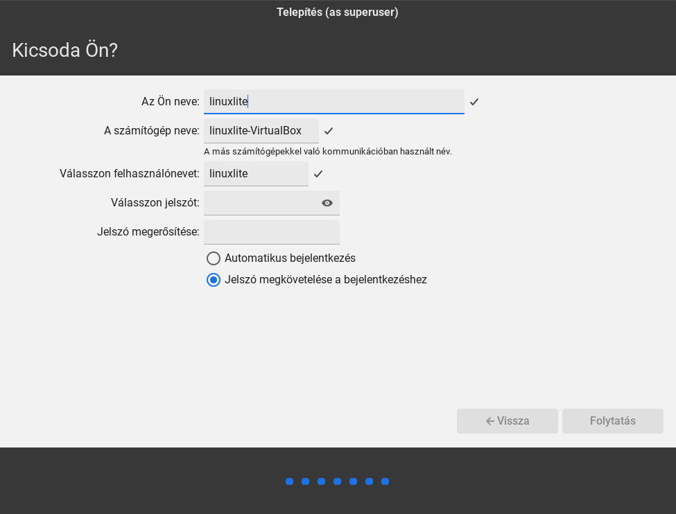
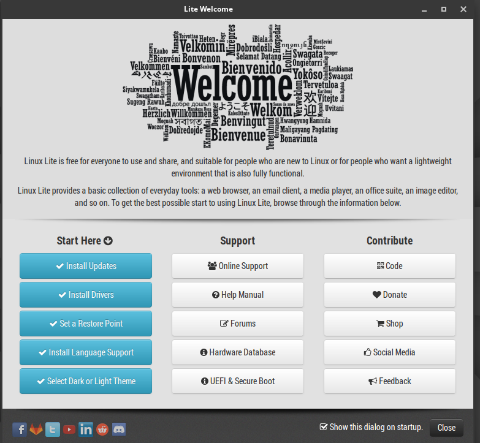

# Linux Lite telepitési utmutató
## VirtualBox beállitása
Első lépésként a [Linux Lite](https://www.linuxliteos.com/index.html) weboldalról le kell tölteni a telepitéshez szükséges iso fájlt. Miután ezzel megvagyunk utána egy virtuális szervert kell létrehozni és ki kell választani a letöltött iso fájlt, valamint meg kell adni, hogy megkora erőforrást szándékozunk ráfordítani a telepíteni kívánt operációs rendszere.  

## Linux Lite telepitése 
Ha ezekkel megvagyunk akkor a befejezés gombra rányomva elkezdi betölteni az operációs rendszert. A telepités befejezéséhez ki kell választani a használni kívánt nyelvet a régiót, valamint hogy, mi legyen a felhasználói profil neve és jelszava ha ez mind megvan akkor azután feltelepiti a rendszert és ha végzet akkor újra kell indítani a rendszert. 

Ha a telepités befejeződőt akkor utána újra kell indítani az operációsrendszert és utána már csak egy lépés van, hogy kész legyen a telepiés le kell tölteni a frissítéseke, drivereket és a language supportot. 

