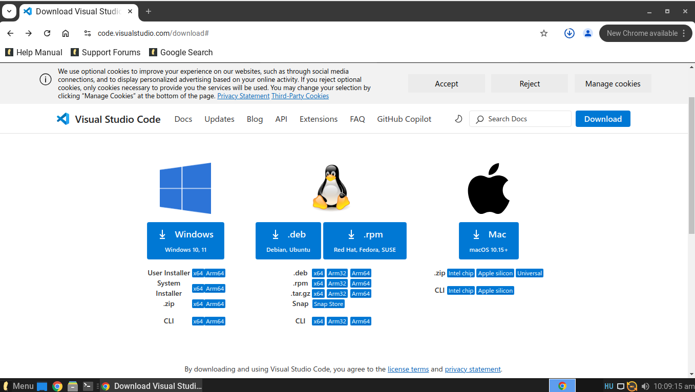
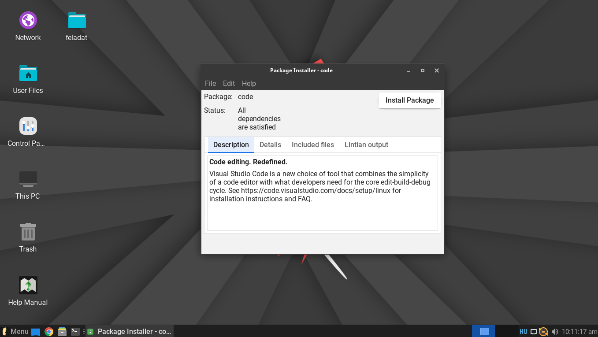
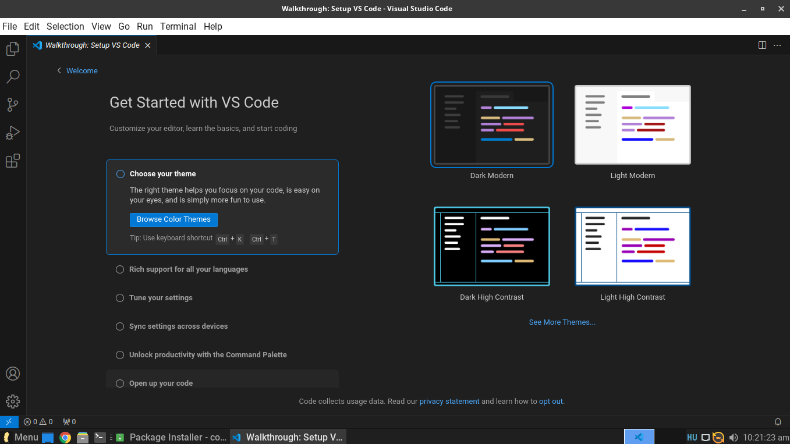
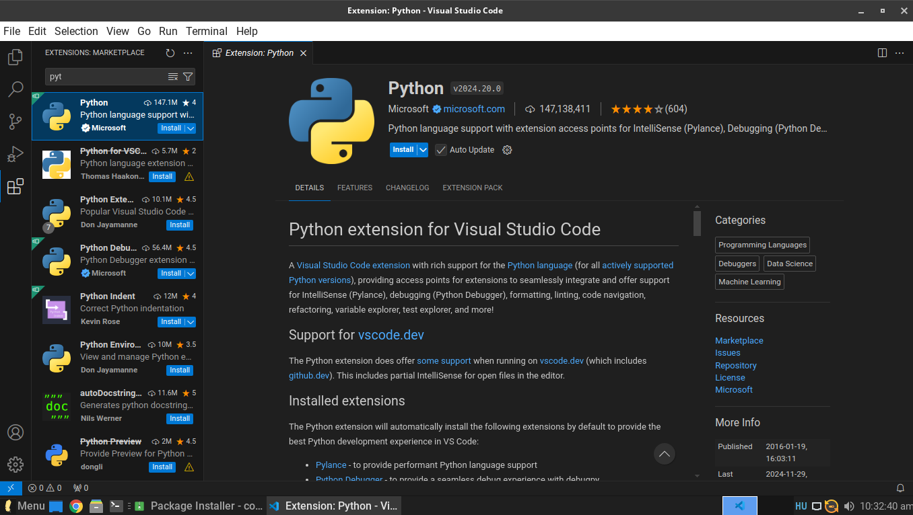
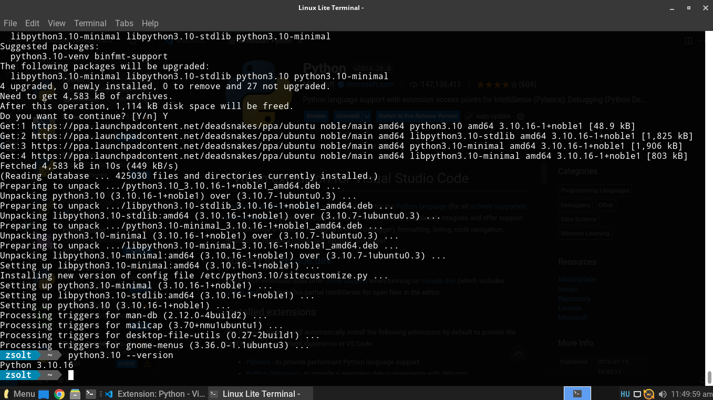

# Visual Studio Code telepitési utmutató Linux lite-ra
## Visual Studio Code telepités 
Első lépésként a [Visual Studio Code](https://code.visualstudio.com/download) telepitőt le kell tölteni.

Miután a telepitő letöltőt meg kell nyitnunk és fel kell telepíteni.

A telepités befejezése után már csak személyre kell szabni a Visual Studio Code-ot. Ki tudjuk választani a témát valamint hogy milyen bővítményeket szeretnénk hozzá adni.

## Python telepités

Hozzá adjuk bővítményként a Visual Studio Code-hoz a Pythont. 

Megnyitjuk a terminált hogy letöltsük a pythont amit az alábbi 4 parancs beírásával tehetünk meg.
1. sudo apt update && sudo apt upgrade -y 
2. sudo apt install software-properties-common
3. sudo add-apt-repository ppa:deadsnakes/ppa
4. sudo apt install python 3.10

Ha mind ezzel kész vagyunk akkor sikeresen telepitettük a pythont az operációs rendszerünkre 

